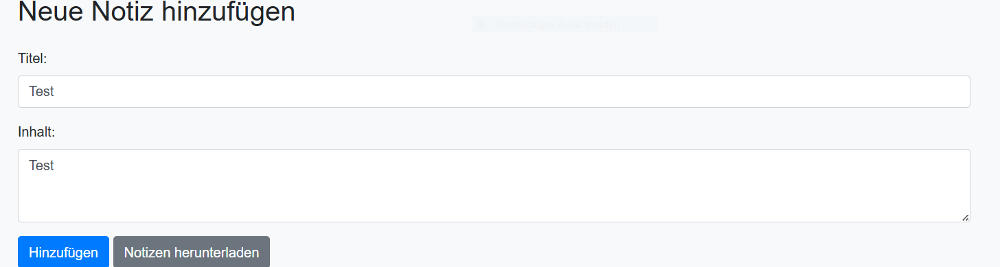
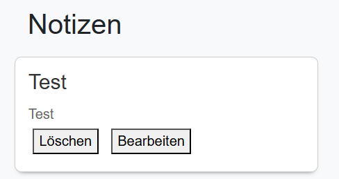
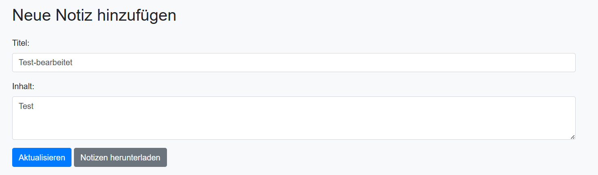
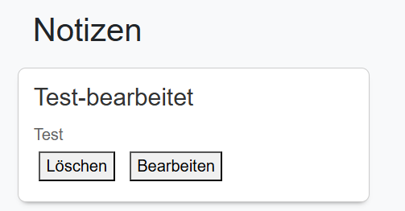
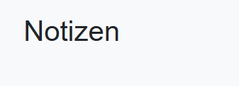
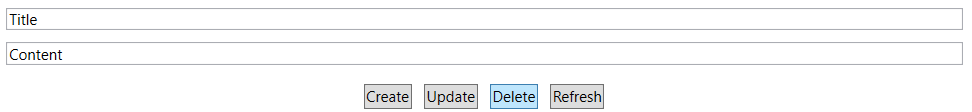
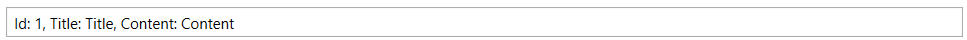

# NoteX

Dieses Repository enthält den Quellcode für NoteX, eine umfassende Notizverwaltungsapplikation.

## Inhaltsverzeichnis
- [Überblick](#überblick)
- [Funktionen](#funktionen)
- [Architektur](#architektur)
- [Installation](#installation)
- [Konfiguration](#konfiguration)
- [Verwendung](#verwendung)
- [Veranschaulichung](#veranschaulichung)
- [API-Endpunkte](#api-endpunkte)


## Überblick
NoteX ist eine ausgeklügelte Notizverwaltungsapplikation, die Benutzern hilft, ihre Notizen nahtlos zu erstellen, zu bearbeiten und zu verwalten. Das Projekt umfasst eine Desktop-Applikation, eine Web-Applikation und einen Backend-Server. Der Server verwaltet Datenoperationen und wird in IntelliJ ausgeführt, während der Web-Client mit der Live Server-Erweiterung in Visual Studio Code bedient wird.

## Funktionen
- Mithilfe der CRUD Funktionen Notizen erstellen, bearbeiten und löschen
- Notizen kategorisieren
- Notizen durchsuchen
- Responsives Web-Interface
- Speicherung der Daten mithilfe von MongoDB

## Architektur
Die NoteX-Applikation ist in drei Hauptkomponenten unterteilt:
1. **Backend-Server**: Verwaltet alle datenbezogenen Operationen und ist in Java geschrieben. Er läuft auf `localhost:8090`.
2. **Web-Applikation**: Bietet eine benutzerfreundliche Oberfläche zur Interaktion mit den Notizen und läuft auf `http://127.0.0.1:5500` unter Verwendung der Live Server-Erweiterung in Visual Studio Code.
3. **Desktop-Applikation**: Eine WPF-Applikation, die auf Windows läuft und dieselben Funktionen wie die Web-Applikation bietet.
4.  **Mongo-DB**: Eine Datenbank, die alle Notizen der Clients abspeichert

## Installation

### Voraussetzungen
- Java Development Kit (JDK)
- IntelliJ IDEA
- Node.js und npm
- Visual Studio Code
- Live Server-Erweiterung für Visual Studio Code
- .NET Framework (für die WPF-Desktop-Applikation)


## Verwendung

### Server starten
1. Öffne IntelliJ IDEA.
2. Starte das Backend-Server-Projekt.
3. Stelle sicher, dass der Server unter `http://localhost:8090` zugänglich ist.

### Web-Applikation starten
1. Öffne Visual Studio Code.
2. Navigiere zum `Notiz_website` Verzeichnis.
3. Starte den Live Server, indem du mit der rechten Maustaste auf die `index.html` Datei klickst und `Open with Live Server` auswählst.
4. Die Web-Applikation sollte nun unter `http://127.0.0.1:5500` zugänglich sein.

### Desktop-Applikation starten
1. Öffne Visual Studio.
2. Lade das `NotizAppDesktop` Projekt.
3. Baue und starte die Desktop-Anwendung.

   
## Konfiguration
Stelle sicher, dass der Backend-Server auf `localhost:8090` läuft und sowohl die Web- als auch die Desktop-Applikation darauf zugreifen können. Die Konfigurationsdateien müssen möglicherweise angepasst werden, um die korrekten Endpunkte und Ports widerzuspiegeln.

# Veranschaulichung

## Funktionen der WebApp

### Erstellen einer Notiz


<br>
Füllen Sie das Formular aus, indem Sie einen Titel und den Inhalt der neuen Notiz eingeben.
Klicken Sie auf die Schaltfläche "Hinzufügen". Dadurch wird die Notiz gespeichert und zur Liste hinzugefügt.


### Bearbeiten einer vorhandenen Notiz:




<br>
Suchen Sie in der Liste nach der Notiz, die Sie bearbeiten möchten.
Klicken Sie auf die Schaltfläche "Bearbeiten", die neben der Notiz angezeigt wird.
Das Formular wird mit den vorhandenen Informationen (Titel und Inhalt) der Notiz gefüllt.
Ändern Sie den Titel und/oder den Inhalt der Notiz nach Bedarf.
Klicken Sie auf "Aktualisieren", um die Änderungen zu speichern.

### Löschen einer vorhandenen Notiz


<br>
Suchen Sie in der Liste nach der Notiz, die Sie löschen möchten.
Klicken Sie auf die Schaltfläche "Löschen", die neben der Notiz angezeigt wird.
Die Notiz wird aus der Liste entfernt und aus der Datenbank gelöscht.

## Funktionen der WPF-Anwendung

### Erstellen einer Notiz


<br>
Geben Sie einen Titel und den Inhalt der neuen Notiz in die entsprechenden Textfelder ein.
Klicken Sie auf die Schaltfläche " zum Erstellen der Notiz. Dadurch wird die Notiz übermittelt und gespeichert.


### Bearbeiten einer vorhandenen Notiz:


<br>
Wählen Sie in der Liste der vorhandenen Notizen diejenige aus, die Sie bearbeiten möchten.
Ändern Sie den Titel und/oder den Inhalt der Notiz in den Textfeldern.
Klicken Sie auf die Schaltfläche "Update" zum Aktualisieren der Notiz. Dadurch werden Ihre Änderungen gespeichert.

###  Löschen einer Notiz


<br>
Wählen Sie die Notiz aus der Liste aus, die Sie löschen möchten.
Klicken Sie auf die Schaltfläche zum Löschen der Notiz . Dadurch wird die ausgewählte Notiz dauerhaft entfernt.

# Ansicht der gespeicherten Daten


## API-Endpunkte

### Alle Notizen abrufen
- **Endpunkt**: `/api/notes`
- **Methode**: GET
- **Funktion**: getAllNotes()
- **Beschreibung**: Ruft alle Notizen ab.
- **Antwort**:
  ```json
  [
    {
      "id": 1,
      "titel": "Notiz-Titel",
      "content": "Inhalt der Notiz",  
    },
    ...
  ]
  
### Notiz nach ID abrufen
- **Endpunkt**: `/api/notes/{id}`
- **Methode**: GET
- **Funktion**: getNoteById(long id)
- **Beschreibung**: Ruft eine einzelne Notiz anhand ihrer ID ab.
- **Antwort**:
- **Falls die Notiz existiert:**
```json
    {
      "id": 1,
      "titel": "Notiz-Titel",
      "content": "Inhalt der Notiz",
    }
   
```
#### Falls die Notiz nicht existiert:
- **Statuscode**: 404 Not Found

### Neue Notiz erstellen
- **Endpunkt**: `/api/notes`
- **Methode**: POST
- **Funktion**: createNote(Note note)
- **Beschreibung**: Erstellt eine neue Notiz
- 
- **Request Body:**:
```json

{
  "titel": "Neue Notiz",
  "content": "Inhalt der neuen Notiz"
}
```
- **Antwort**:
- **Statuscode**: 201 Created
- **Response Body**:
```json

{
  "id": 3,
  "titel": "Neue Notiz",
  "content": "Inhalt der neuen Notiz"
}
```

### Notiz aktualisieren
- **Endpunkt**: `/api/notes/{id}`
- **Methode**: PUT
- **Funktion**:updateNote(long id, Note noteDetails)
- **Beschreibung**:  Aktualisiert eine vorhandene Notiz anhand ihrer ID.

- **Request Body:**:
```json

{
  "titel": "Aktualisierte Notiz",
  "content": "Neuer Inhalt"
}
```
- **Antwort**:
- **Falls die Notiz aktualisiert wurde**:
```json

{
  "id": 1,
  "titel": "Aktualisierte Notiz",
  "content": "Neuer Inhalt"
}
```
- **Falls die Notiz nicht gefunden wurde**:
- **Statuscode**: 404 Not Found

### Notiz löschen
- **Endpunkt**: `/api/notes/{id}`
- **Methode**: DELETE
- **Funktion**: deleteNote(long id)
- **Beschreibung**: Löscht eine Notiz anhand ihrer ID.

-  **Antwort**:
- **Statuscode**: 200 OK


## Diskussion der Ergebnisse

Am Ende dieser monatelangen Entwicklung präsentiere ich die erste Version der Notizapp. Die Benutzeroberfläche ist einfach und übersichtlich gestaltet, sowohl für WPF als auch für Web, was das Erstellen, Bearbeiten und Löschen von Notizen vereinfacht. Die zuverlässige Speicherung der Daten in einer MongoDB-Datenbank gewährleistet jederzeitigen Zugriff und Sicherheit.

### Zusammenfassung

Die Notizapp bietet eine einfache Benutzeroberfläche sowohl als Desktop-Anwendung als auch als WebApp. Die REST-API ermöglicht Echtzeitkommunikation mit der Datenbank.

### Hintergründe

Die Entwicklung der App konzentrierte sich stark auf Benutzerfreundlichkeit. Die Verwendung moderner Technologien wie Spring-Boot, WPF, HTML, CSS, JavaScript und JSON stellt sicher, dass die API für zukünftige Anforderungen gerüstet ist. Die Nutzung von MongoDB gewährleistet sichere Speicherung und effiziente Datenverwaltung.

### Ausblick

Zukünftig wird die Notizapp um neue Funktionen erweitert, wie die Organisation von Notizen in Ordnern oder Kategorien sowie die Unterstützung von Rich-Text-Formatierung. Ein Benachrichtigungssystem kann implementiert werden, um Benutzer über wichtige Ereignisse zu informieren. Kontinuierliches Benutzerfeedback wird genutzt, um die Benutzerfreundlichkeit weiter zu verbessern und eine effiziente Notizverwaltung zu gewährleisten.


